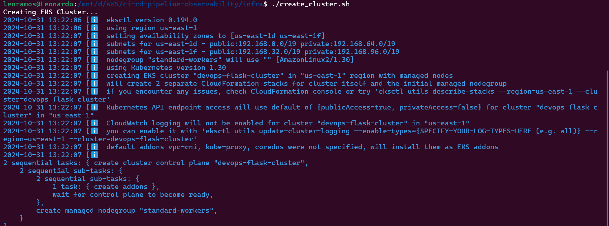
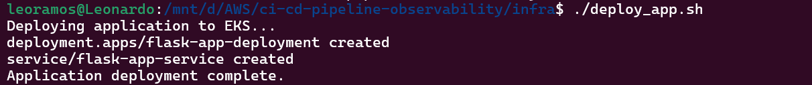
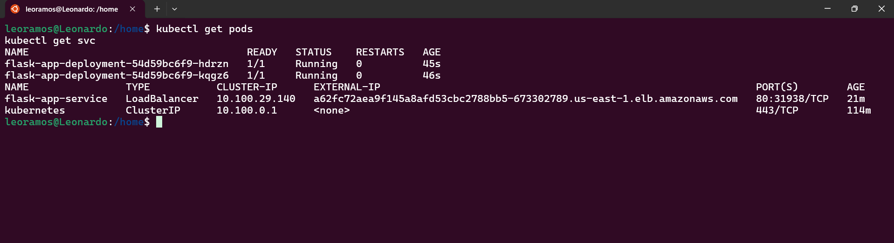

# CI/CD Pipeline com Observabilidade

[](https://github.com/features/actions)
[](https://kubernetes.io/) 
[](https://grafana.com/) 
[](https://prometheus.io/)
[](https://www.docker.com/)
[](https://flask.palletsprojects.com/)


Este repositório contém uma aplicação Flask com um pipeline CI/CD implementado com GitHub Actions, Docker, Kubernetes (EKS) e um sistema de monitoramento usando Grafana e Prometheus. O projeto foi criado para automatizar o deploy na AWS e oferecer monitoramento em tempo real.


## Descrição

O objetivo deste projeto é demonstrar a utilização de um pipeline de CI/CD para uma aplicação Flask na AWS utilizando Docker, Kubernetes (EKS) e GitHub Actions. A aplicação principal é um serviço Flask que exibe uma mensagem de boas-vindas e está equipada com monitoramento em tempo real através de Grafana e Prometheus. O ambiente é configurado dentro de um EKS, com instâncias para a aplicação, Load Balancer (EBS), Grafana e Prometheus. Utilizamos o Github Actions para permitir implantações rápidas e escaláveis, onde cada vez que alterássemos o código, a Pipeline alterava a aplicação em poucos segundos, garantindo que a infraestrutura e os serviços estejam sempre disponíveis e monitorados de maneira eficiente.<p>

## Estrutura do Projeto

- **app/**: Código fonte da aplicação Flask e Dockerfile.
- **infra/**: Scripts Shell de infraestrutura para configurar o seu Cluster EKS, Prometheus, e Grafana.
- **.github/workflows/**: Workflows do GitHub Actions para CI/CD.
- **images/**: Prints e imagens para documentação.

## Pré-requisitos

- Docker e Docker Hub.
- AWS CLI configurado com as credenciais apropriadas.
- Kubernetes CLI (kubectl) e eksctl.
- GitHub Secrets configurados (AWS_ACCESS_KEY_ID, AWS_SECRET_ACCESS_KEY, DOCKER_USERNAME, DOCKER_PASSWORD).

## Passo a Passo

1. **Clone o Repositório**
   ```bash
   git clone https://github.com/leoferamos/ci-cd-pipeline-observability.git
   cd ci-cd-pipeline-observability
2. **Construir e Enviar a Imagem para o Docker Hub**
   
   #### Certifique-se de estar logado no Docker Hub:
   ```bash
   docker login
   ```
   #### Construa a imagem Docker a partir do Dockerfile:
   ```bash
   docker build -t seu_usuario_docker/flask-app:tag .
   ```
   #### Suba a imagem para o Docker Hub:
   ```bash
   docker push seu_usuario_docker/flask-app:tag
3. **Implantar aplicação na AWS**

   ### Certifique-se de que você está logado na AWS por meio do:
   ```bash
   aws configure
   ```
   ### Para criar seu Cluster entre no repositório infra e execute:
   ```bash
   ./create_cluster.sh
   ```
   
   
   ### Faça o deploy no seu Cluster:
   #### Antes de executar o próximo Script, altere o deployment.yaml para seu nome de usuário.
   ```bash
   ./deploy_app.sh
   ```
   

   ### Verifique os seus pods e seu Load Balancer
   ```bash
   kubectl get pods
   kubectl get svc
   ```
   

   
   

   


