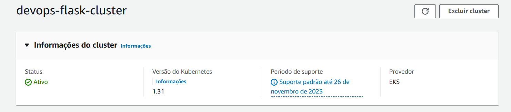
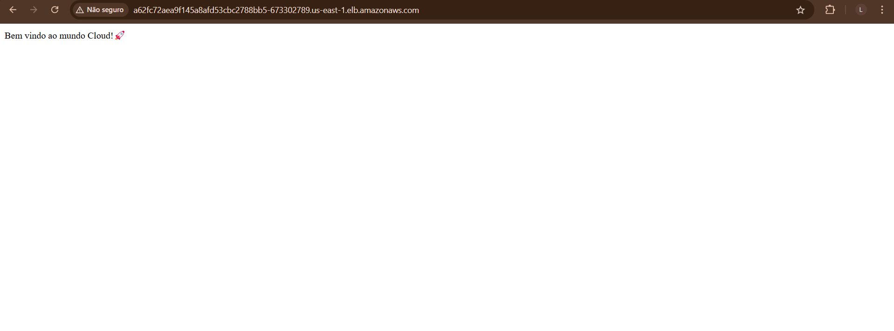
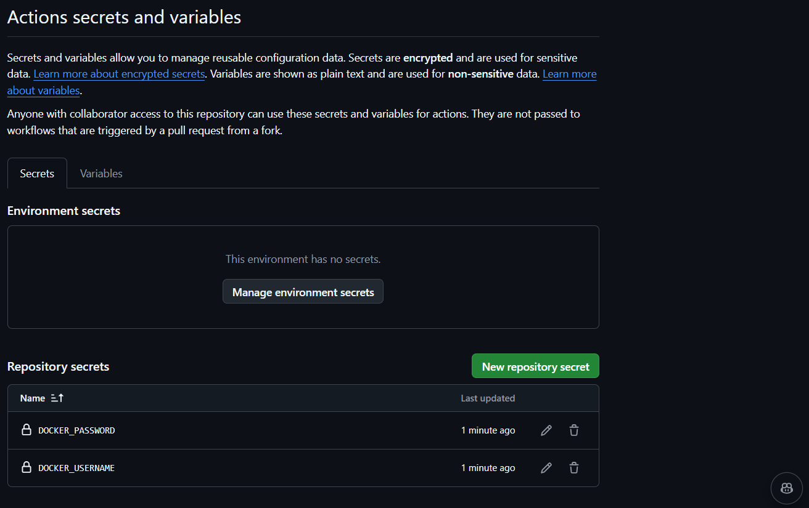
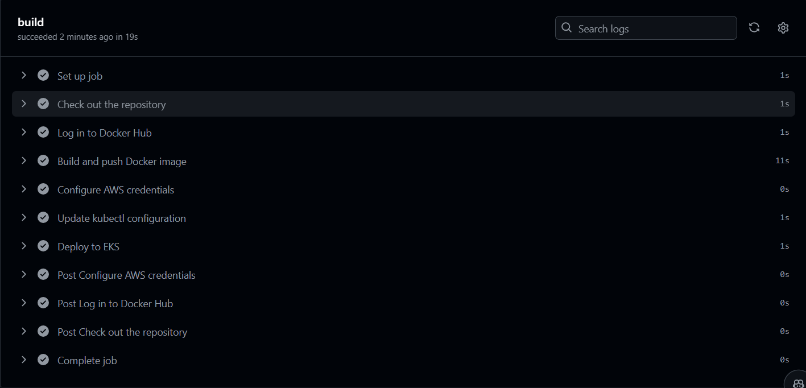
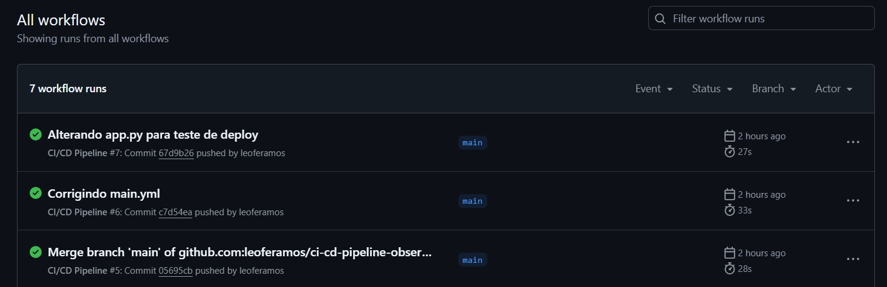
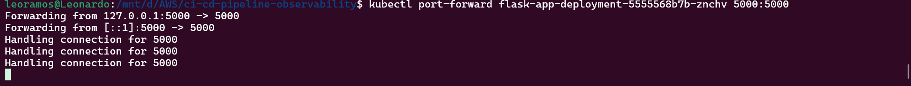
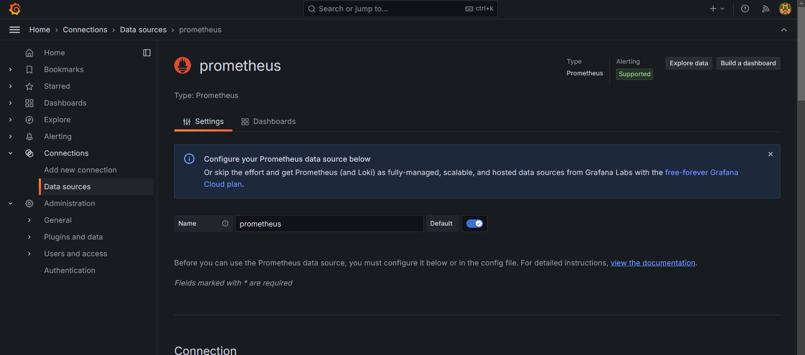
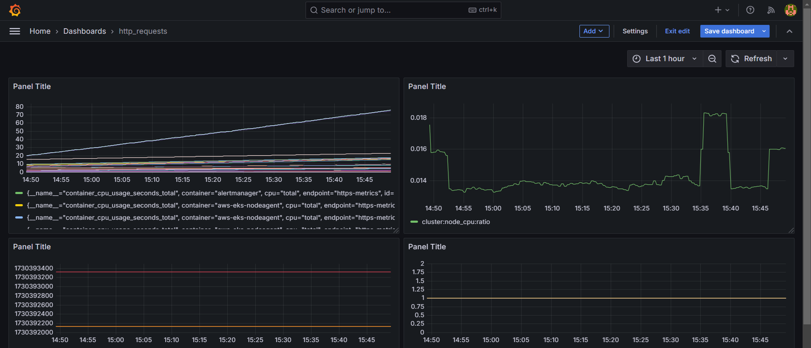

# CI/CD Pipeline com Observabilidade

[](https://github.com/features/actions)
[](https://kubernetes.io/) 
[](https://grafana.com/) 
[](https://prometheus.io/)
[](https://www.docker.com/)
[](https://flask.palletsprojects.com/)


Este repositório contém uma aplicação Flask com um pipeline CI/CD implementado com GitHub Actions, Docker, Kubernetes (EKS) e um sistema de monitoramento usando Grafana e Prometheus. O projeto foi criado para automatizar o deploy na AWS e oferecer monitoramento em tempo real.


## Descrição

O objetivo deste projeto é demonstrar a utilização de um pipeline de CI/CD para uma aplicação Flask na AWS utilizando Docker, Kubernetes (EKS) e GitHub Actions. A aplicação principal é um serviço Flask que exibe uma mensagem de boas-vindas e está equipada com monitoramento em tempo real através de Grafana e Prometheus. O ambiente é configurado dentro de um EKS, com instâncias para a aplicação, Load Balancer (EBS), Grafana e Prometheus. Utilizamos o Github Actions para permitir implantações rápidas e escaláveis, onde cada vez que alterássemos o código, a Pipeline alterava a aplicação em poucos segundos, garantindo que a infraestrutura e os serviços estejam sempre disponíveis e monitorados de maneira eficiente.<p>

## Estrutura do Projeto

- **app/**: Código fonte da aplicação Flask e Dockerfile.
- **infra/**: Scripts Shell de infraestrutura para configurar o seu Cluster EKS, Prometheus, e Grafana.
- **.github/workflows/**: Workflows do GitHub Actions para CI/CD.
- **images/**: Prints e imagens para documentação.

## Pré-requisitos

- Docker e Docker Hub.
- AWS CLI configurado com as credenciais apropriadas.
- Kubernetes CLI (kubectl) e eksctl.
- Helm Instalado.

## Passo a Passo

1. **Clone o Repositório**
   ```bash
   git clone https://github.com/leoferamos/ci-cd-pipeline-observability.git
   cd ci-cd-pipeline-observability
2. **Construir e Enviar a Imagem para o Docker Hub**
   
   #### Certifique-se de estar logado no Docker Hub:
   ```bash
   docker login
   ```
   #### Construa a imagem Docker a partir do Dockerfile:
   ```bash
   docker build -t seu_usuario_docker/flask-app:tag .
   ```
   #### Suba a imagem para o Docker Hub:
   ```bash
   docker push seu_usuario_docker/flask-app:tag
3. **Implantar aplicação na AWS**

   #### Certifique-se de que você está logado na AWS por meio do:
   ```bash
   aws configure
   ```
   #### Para criar seu Cluster entre no repositório infra e execute:
   ```bash
   ./create_cluster.sh
   ```
   
   
   #### Faça o deploy no seu Cluster:
   ##### Antes de executar o próximo Script, altere no deployment.yaml para seu nome de usuário.
   ```bash
   ./deploy_app.sh
   ```
   

   ### Verifique os seus pods e seu Load Balancer
   ```bash
   kubectl get pods
   kubectl get svc
   ```
   

   #### Verifique no seu console da AWS

   

   #### A aplicação já pode ser acessada pelo link que você verificou no Load Balancer após o comando _kubectl get svc_ anteriormente:
   
    


4. **Configurar CI/CD da sua aplicação**
   ### Configurar GitHub Secrets

 - Acesse o seu repositório no GitHub.
 - Clique em Settings (Configurações) no menu superior.
 - No menu lateral, clique em Secrets and variables e depois em Actions.
 - Clique em New repository secret para adicionar cada um dos seguintes secrets:
 - AWS_ACCESS_KEY_ID: Sua chave de acesso da AWS.
 - AWS_SECRET_ACCESS_KEY: Sua chave secreta da AWS.
 - DOCKER_USERNAME: Seu nome de usuário no Docker Hub.
 - DOCKER_PASSWORD: Sua senha do Docker Hub.
 - #### * Nota: Tome cuidado e não exponha essas chaves em nenhum lugar*
   ### Painel do Git Hub Secrets:
   
   

   ### Após qualquer alteração no código da sua aplicação no seu GitHub, a esteira será ativada e fará a alteração no seu Docker hub e EKS.
   
   

   ### Implementação finalizada em segundos
   
   
5. **Instalação Grafana e Prometheus**
   ### No diretório infra, execute o comando para instalar o Grafana e o Prometheus no seu Cluster:
   ```bash
   ./install_grafana.sh
   ```

- Para o Prometheus coletar as métricas, você pode usar o comando de port forwarding do Kubernetes. Isso permite que você redirecione uma porta do seu cluster EKS para a sua máquina local.
   ### Para realizar o Port Forwarding execute o seguinte comando, substituindo `<nome-do-pod>` pelo nome do pod que está executando sua aplicação Flask:
   
   ```bash
   kubectl port-forward <nome-do-pod> 5000:5000
   ```
   

   ### Para configurar o Prometheus para coletar métricas do seu serviço Flask, execute o comando:
   ```bash
   kubectl apply -f service_monitor.yaml
   ```

6. **Acessar o Grafana e Configurar o Prometheus**

   - Após instalar o Grafana no seu cluster, siga os passos abaixo para acessá-lo e adicionar o Prometheus como fonte de dados:
   - Para acessar o Grafana, primeiro, você precisará fazer o port-forward do serviço do Grafana para a sua máquina local. Execute o seguinte comando:
     
   ```bash
   kubectl --namespace monitoring port-forward svc/grafana 3000:80
   ```
   #### Acesse o Grafana pelo link: <http://localhost:3000>
   - O usuário padrão é admin e a senha pode ser obtida com o comando:
   ```bash
   kubectl get secret --namespace monitoring grafana -o jsonpath='{.data.admin-password}' | base64 --decode
   ```

   - No painel inicial do Grafana, clique em Configuration (ícone de engrenagem) no menu lateral.
   - Selecione Data Sources.
   - Clique em Add data source.
   - Escolha Prometheus da lista de opções.

   
  
   - Na configuração do Prometheus, insira a URL do Prometheus, http://prometheus.monitoring.svc.cluster.local:9090.
   - Vá para Create (ícone de "+") e selecione Dashboard.
   - Clique em Save & Test para verificar a conexão.

   ### Criar Painéis de Monitoramento
   #### Agora que o Prometheus está configurado como fonte de dados, você pode criar painéis (dashboards) para visualizar as métricas da sua aplicação Flask:

   - Vá para Create (ícone de "+") e selecione Dashboard.
   - Adicione novos gráficos e selecione o Prometheus como a fonte de dados.
   - Construa suas consultas para visualizar as métricas desejadas.
     
   

   ## Conclusão:
   Este projeto integra CI/CD e monitoramento em um ambiente AWS com Kubernetes, Docker, Grafana e Prometheus. A configuração automatizada permite deploys ágeis, enquanto o monitoramento oferece alta disponibilidade e estabilidade. O pipeline é uma base escalável que fortalece a confiabilidade da infraestrutura e suporta a evolução contínua da aplicação com observabilidade e automação.
   
